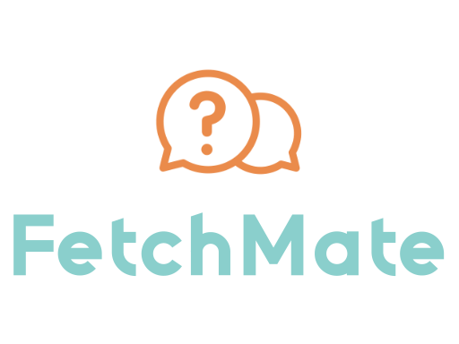
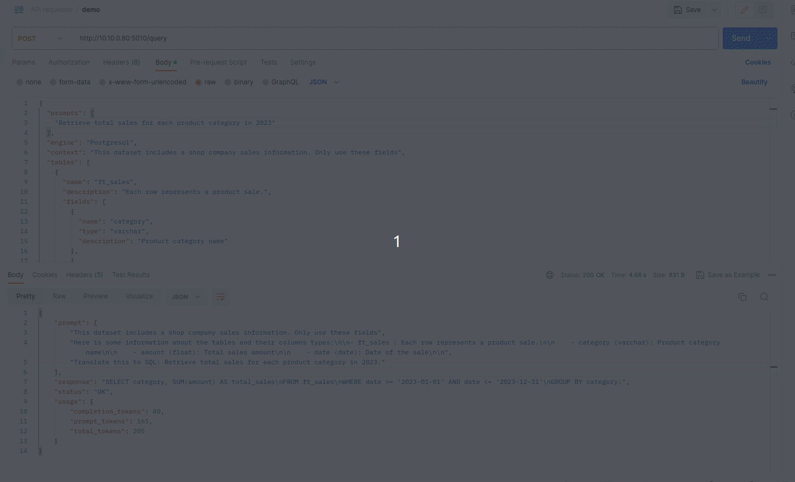

<div align="center">
    
</div>

# FetchMate: Human-to-SQL Conversion Microservice

This stateless microservice allows you to query data by asking questions in human language without the need to know SQL language.

<div align="center">
    
</div>

## Preamble

### Operating Principle

1. **User Query Compilation:** Users input questions in human language, specifying the data they seek.

2. **Database Structure and Content Compilation:** The microservice compiles the database's structure, including table names, column names, types, and functional descriptions, along with the actual data in the tables.

3. **Template-Based Prompt Generation:** The user's query and the compiled database information are transformed into a prompt using predefined templates. These templates facilitate the construction of meaningful and contextually accurate prompts for ChatGPT.

4. **ChatGPT Processing:** The generated prompt is sent to ChatGPT, instructing it on how to compose the SQL query based on the user's input and the compiled dataset information.

5. **SQL Query Construction:** ChatGPT processes the prompt and constructs the SQL query, incorporating the necessary fields, conditions, and operations.

6. **Query Execution:** The generated SQL query is returned to the user.

### Usage Example

Suppose a user asks, "Retrieve total sales for each product category in the last month.".

The micro service APIs can be used with this payload:

```json
{
  "prompts": ["Retrieve total sales for each product category in 2023"],
  "engine": "Postgresql",
  "context": "This dataset includes a shop company sales information. Only use these fields",
  "tables": [
    {
      "name": "ft_sales",
      "description": "Each row represents a product sale.",
      "fields": [
        {
          "name": "category",
          "type": "varchar",
          "description": "Product category name"
        },
        {
          "name": "amount",
          "type": "float",
          "description": "Total sales amount"
        },
        {
          "name": "date",
          "type": "date",
          "description": "Date of the sale"
        }
      ]
    }
  ]
}
```

This prompt is transformed to a prompt that is sent to ChatGPT so that ChatGPT constructs the SQL query:

```sql
SELECT category, SUM(amount) AS total_sales
FROM ft_sales
WHERE date >= '2023-01-01' AND date < '2024-01-01'
GROUP BY category
```

## Getting Started

### Create .env

You need to create the `.env` file. An example is provided in `.env.example`:

- Setting `DEBUG=1` launches debug mode. To debug, after running `make start`, wait a few seconds for the container to start, then go to VSCode > Run and Debug > "Debug". If you set a breakpoint, the debugger will stop there.

- Setting `DEBUG_RESPONSE=1` is used for development/debugging purposes. If `DEBUG_RESPONSE=1`, OpenAI won't be called.
  - If the payload is `{prompts:["input"], ...}`, the entire payload is returned.
  - If the payload is `{prompts:["template"], ...}`, the generated prompt is returned.
  - If the payload is `{prompts: ["help"], ..}`, it returns a pre-made sentence.
  - Otherwise, it returns `prompts[0]` as the response.

### Create an OpenAI Token

To use OpenAI services, you need an API key. Here are the steps to create an OpenAI token:

1.  **Refer to OpenAI Documentation:** Follow the official OpenAI documentation to create your API key. You can find detailed instructions on how to obtain your key in the [OpenAI Documentation](https://platform.openai.com/).

2.  **Update Environment Variables:** Once you have your API key, modify the `.env` file and add the following line:

    OPENAPI_KEY_API=your-openai-api-key

Replace `your-openai-api-key` with the actual API key you obtained from OpenAI.

### Run the Service

- Run `make build` to build the service.
- Run `make start` to launch the service.

### Try it

You can call API with a POST [http://localhost:5010/query](http://localhost:5010/query) with a payload in the following format:

```json
{
  "engine": "SQL engine to use: MySQL, PostgreSQL, ...",
  "context": "General context about your dataset",
  "prompts": ["Ask your question about your data here"],
  "tables": [
    {
      "name": "table name",
      "description": "functional description of the table, what it contains in terms of data, etc.",
      "columns": [
        {
          "name": "column name in the table",
          "type": "column type (integer, number, string, varchar, ...)",
          "description": "what this column contains, if it's an FK, how it's related to the rest of tables, etc."
        }
        //...
      ]
    }
    //...
  ]
}
```

## Grafana

A [grafana plugin](https://github.com/dorianrod/grafana-fetchmate-datasource) has been developped to use this micro service

## Contributing

We welcome contributions from the community. If you'd like to contribute, please follow these steps:

1.  Fork the repository on GitHub.
2.  Clone your forked repository to your local machine.
3.  Create a new branch for your feature or bug fix.
4.  Make your changes and commit them with a clear message.
5.  Push your changes to your fork on GitHub.
6.  Open a pull request from your branch to the main repository's `main` branch.
7.  Be sure to describe your changes in detail and explain why they are necessary.

## License

This project is licensed under the Apache License 2.0 - see the [LICENSE](./LICENSE) file for details.
